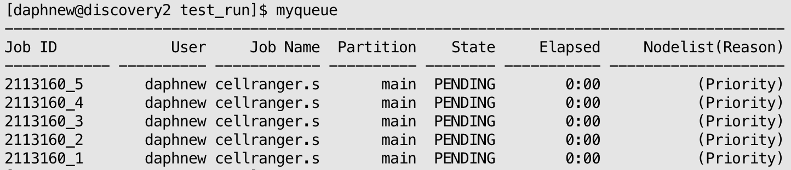

# cellranger-arc pipeline

## Overview

>This tutorial is written specifically for the pipeline setup used by USC MGC. These steps may not work if running on a local machine.

The 10X Genomics `cellranger-arc` pipeline works for multiome data, specifically analysing chromatin accessibility (ATAC) and gene expression (GEX) data **together**.

To see tutorials for other pipelines, see here: [choosing the correct pipeline](../README.md#pipeline-tutorials).


---

## Step 1. Set up project directory

**1. Set up the project directory within the `multiome` directory.**

- General naming convention: [PI_last_name]\_[analysis type]_[date]

```
cd /project2/weisenbe_1344/MGC/singleCell

mkdir Wong_Multiome_20250912
```

**2. Within the project directory, create the following folders:**

```
cd /project2/weisenbe_1344/MGC/multiome/Wong_Multiome_20250912

mkdir gex-fastqs atac-fastqs run1
```

## Step 2. Download FASTQ files from source to corresponding folder

From [Illumina Basespace](../other_tutorials/file_transfers.md#basespace-overview)

From [AWS]()

From [local machine]()


## Step 3. Prepare required files

Each cellranger run has four required files: `cellranger-arc.slurm`, `config_cellranger-arc.txt`, `arc-libraries.csv`, and `samplesheet.txt`.

**1. Copy the files from the scripts folder.**

```
cd /project2/weisenbe_1344/MGC/multiome/Wong_Multiome_20250912/run1

# Copy over the scripts
cp /project2/weisenbe_1344/scripts/experiments/cellranger/* .
```

**2. Write samplesheet (pulls sample names from fastq file names).**
- The command separates the file name by underscores and separates them into fields. 
- Change `-f1-4` based on how many fields you want to keep. 
- EXAMPLE:
   - For `222_20101169_S9_L001_R1_002.fastq.gz`, the file name will be separated into:
     - 222
     - 20101169
     - S9
     - L0001
     - R1
     - 002
    - Since the sample name is 222_20101169, the command will be modified to `-f1-2`.
```
# Replace -f1-4 with number of underscores

# Paste this directly in the terminal within the run1 directory

for file in ../fastq/*.fastq.gz; do basename "$file" | cut -d'_' -f1-4; done | sort -u > samplesheet.txt
```
**3. Create libraries csv**
- This csv file will tell cellranger-arc the location and type of fastqs.
- Change -f1-2 and -f1-3 based on fastq naming
```
# Replace path to fastqs
# Change -f1-2 and -f1-3 if needed
# Copy and paste entire command into terminal 


GEX_BASE="/project2/weisenbe_1344/MGC/multiome/Rhie_Multiome_20250910/gex-fastqs"; \
ATAC_BASE="/project2/weisenbe_1344/MGC/multiome/Rhie_Multiome_20250910/atac-fastqs"; \
( \
  echo "fastqs,sample,library_type"; \
  for f in "$GEX_BASE"/*_R1_*.fastq.gz; do \
    s=$(basename "$f" | cut -d'_' -f1-2); \
    echo "$GEX_BASE,$s,Gene Expression"; \
  done; \
  for f in "$ATAC_BASE"/*_R1_*.fastq.gz; do \
    s=$(basename "$f" | cut -d'_' -f1-3); \
    echo "$ATAC_BASE,$s,Chromatin Accessibility"; \
  done \
) | sort -u > arc-libraries.csv
```

**4. Edit config file**- 
- Replace `FILE` variable with the correct path to samplesheet
- Replace `FASTQ` variable with the correct path to fastq directory
- If analysing mouse data, change `REFER` variable to the mouse reference: `/project2/weisenbe_1344/MGC/resources/multiome/refdata-cellranger-arc-GRCm39-2024-A`. 
```
FILE="/project2/weisenbe_1344/MGC/multiome/Wong_Multiome_20250912/run1/samplesheet.txt"

REFER="/project2/weisenbe_1344/MGC/resources/singlecell/refdata-cellranger-arc-GRCh38-2024-A"

CSV="/project2/weisenbe_1344/MGC/multiome/Wong_Multiome_20250912/run1/arc-libraries.csv"

CORES="32"

MEM="64"
```

**5. Change slurm script paramters**
- Change the slurm header `#SBATCH --array` option with the correct number of samples
- Replace the `SOURCE` path to the config_cellranger.txt file 
- _Note_: Verify the slurm script is billed to the correct account (`#SBATCH --account=weisenbe_1344`).

```
#SBATCH --array=1-5

source /project2/weisenbe_1344/MGC/singleCell/Wong_Multiome_20250912/run1/config_cellranger-arc.txt
```

## Step 4. Run the script
**1. Submit the job to SLURM**
- Replace the "5" with the number of samples in the project
- The number of samples should match the number of lines in your samplesheet (`wc -l samplesheet.txt`)

```
sbatch --array=1-5 cellranger.slurm
```

**2. Check on the status of your run**
- Run `myqueue` to check on all of your current SLURM jobs
  - It may take some time for the job to start (PENDING > STARTED) depending on how busy the queue is and how many resources you are requesting.

- Each sample will have their own job, like so:



- If you want to cancel any of the SLURM jobs, use `scancel`

```
# Cancel all array jobs
scancel 2113160

# Cancel a specific array job
scancel 2113160_1
```

## Cellranger Outputs
- Each sample will have its own output directory and a corresponding SLURM output log (slurm-2113160_*.out).

- Double check that each sample's QC metrics `outs/web_summary.html` looks okay.
  - Open the HTML file in the browser, not terminal

- Please make sure the directory permissions are set to 775 so others can access or move the directory if needed.
```
chmod 775 /project2/weisenbe_1344/MGC/multiome/Wong_Multiome_20250912
```
