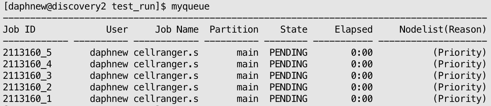

# Cellranger pipeline

## Overview

>This tutorial is written specifically for the pipeline setup used by USC MGC. These steps may not work if running on a local machine.

The 10X Genomics `cellranger` pipeline ONLY works for gene-expression data (GEX). 

To see tutorials for other pipelines, see here: [choosing the correct pipeline](../README.md#pipeline-tutorials).


---

## Step 1. Set up project directory

**Set up the project directory within the `singleCell` directory.**

- General naming convention: [PI_last_name]\_[analysis type]_[date]

```
cd /project2/weisenbe_1344/MGC/singleCell

mkdir Wong_GEX_20250904
```

**Within the project directory, create the following folders:**

```
cd /project2/weisenbe_1344/MGC/singleCell/Wong_GEX_20250904

mkdir fastq run1
```

## Step 2. Download FASTQ files from source

From [Illumina's Basespace]()

From [AWS]()

From [local machine]()


## Step 3. Prepare required files

Each cellranger run has three required files: `cellranger.slurm`, `config_cellranger.txt`, and `samplesheet.txt`.

**Copy the files from the scripts folder.**

```
cd /project2/weisenbe_1344/MGC/singleCell/Wong_GEX_20250904/run1

# Copy over the scripts
cp /project2/weisenbe_1344/scripts/experiments/cellranger/* .
```

**Re-write the samplesheet (pulls sample names from fastq file names).**
- Change `-f1-4` based on number of underscores in fastq sample name before L001_R1_001


- EXAMPLES:
   - For `350_L001_R1_001.fastq.gz`, change command to `-f1` because there is one underscore "\_" before L001_R1_001
   - For `R54_S28_L001_R2_001.fastq.gz`, change command to `-f1-2` because there are two underscores "\_"
   - For `222_20101169_S9_L001_R1_002.fastq.gz`, change command to `-f1-3` because there are three underscores "\_"
```
# Replace -f1-4 with number of underscores

# Paste this directly in the terminal within the run1 directory

for file in ../fastq/*.fastq.gz; do basename "$file" | cut -d'_' -f1-4; done | sort -u > samplesheet.txt
```

**Edit config file**- 
- Replace `FILE` variable with the correct path to samplesheet
- Replace `FASTQ` variable with the correct path to fastq directory

*_Note_: If analysing mouse data, change `REFER` variable to the mouse reference: `/project2/weisenbe_1344/MGC/resources/singlecell/refdata-gex-GRCm39-2024-A`. 
```
FILE="/project2/weisenbe_1344/MGC/singleCell/Wong_GEX_20250904/run1/samplesheet.txt"

REFER="/project2/weisenbe_1344/MGC/resources/singlecell/refdata-gex-GRCh38-2024-A"

FASTQS="/project2/weisenbe_1344/MGC/singleCell/Wong_GEX_20250904/fastq"

CORES="32"

MEM="64"
```

**Edit slurm script**
- Change the slurm header `#SBATCH --array` option with the correct number of samples
- Replace the `SOURCE` path to the config_cellranger.txt file 

*_Note_: Check that the slurm script is billed to the correct account (`#SBATCH --account=weisenbe_1344`).

```
#SBATCH --array=1-5

source /project2/weisenbe_1344/MGC/singleCell/Wong_GEX_20250904/run1/config_cellranger.txt
```

## Step 4. Run the script
**Submit the job to SLURM**
- Replace the "5" with the number of samples in the project
- The number of samples should match the number of lines in your samplesheet (`wc -l samplesheet.txt`)

```

sbatch --array=1-5 cellranger.slurm
```
**Check on the status of your run**
- Run `myqueue` to check on all of your current SLURM jobs
  - It may take some time for the job to start (PENDING > STARTED) depending on how busy the queue is and how many resources you are requesting.

- Each sample will have their own job, like so:



- If you want to cancel any of the SLURM jobs, use `scancel`

```
# Cancel all array jobs
scancel 2113160

# Cancel a specific array job
scancel 2113160_1
```

## Cellranger Outputs
- Each sample will have its own output directory and a corresponding SLURM output log (slurm-2113160_*.out).

- Double check that each sample's QC metrics `outs/web_summary.html` looks okay.
  - Open the HTML file in the browser, not terminal

- Please make sure the directory permissions are set to 775 so others can access or move the directory if needed.
```
chmod 775 /project2/weisenbe_1344/MGC/singleCell/Wong_GEX_20250904
```
